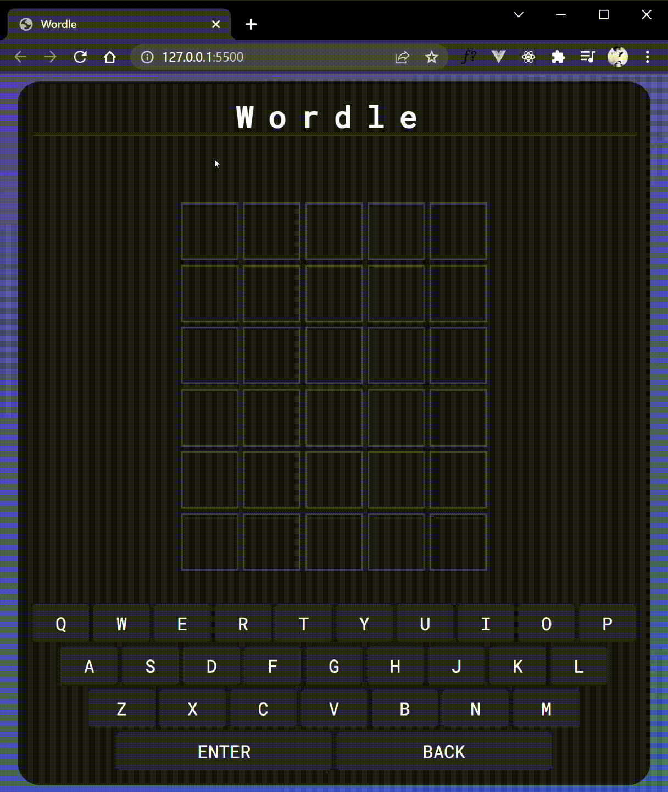

# Wordle Game
### An implementation of the famous wordle game using vanilla Javascript and Rapid API.

## Gameplay
> A five-letter word is chosen which player aims to guess within six tries.After every guess, each letter is marked as either green, yellow or gray: green indicates that letter is correct and in the correct position, yellow means it is in the answer but not in the right position, while gray indicates it is not in the answer at all.
Multiple instances of the same letter in a guess, such as the "o"s in "robot", will be colored green or yellow only if the letter also appears multiple times in the answer; otherwise, excess repeating letters will be colored gray. 

## Demo

## APIs Used
- Random Words - https://rapidapi.com/sheharyar566/api/random-words5/
- Dictionary by API-Ninjas - https://rapidapi.com/apininjas/api/dictionary-by-api-ninjas/